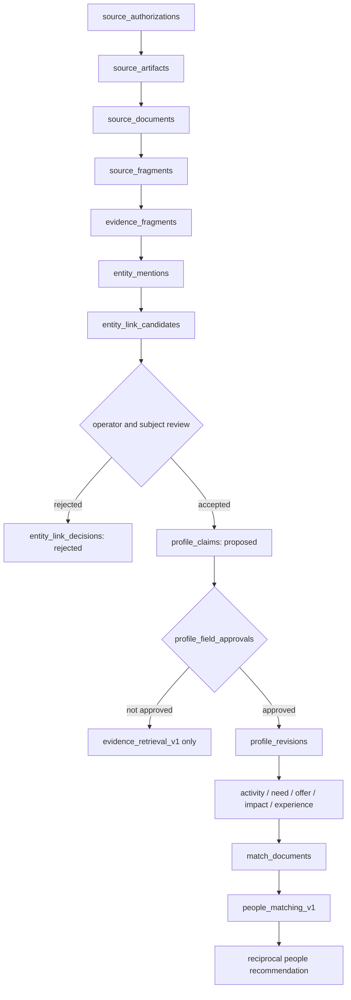

# Local evidence and people-matching schema reference

This records what the primary session validated locally on 2026-07-29 so that
an agent continuing from this branch can distinguish working evidence
artifacts from planned production schema.

It is a reference, not a production-data claim:

- no Supabase migration or write was performed;
- no raw blog corpus, embedding vector, secret, or local SQLite file is
  committed;
- no external person was linked automatically to an existing member;
- no public biography was promoted to a current Need, Offer, availability, or
  matching-consent fact.

## Validated local inputs

| Input | Locally read |
|---|---:|
| Naver Blog `sociallnnovation`, category `사혁넷 사람들` | 522 posts |
| Supabase `organizations` | 80 rows |
| Supabase `subgroup_map` | 80 rows |
| Supabase `collab_cases` | 40 rows |
| Supabase `collab_relations` | 60 rows |

The public-blog collection was authorized by a direct user instruction on
2026-07-29 and recorded locally as
`authorization=user_directive`. Permitted downstream use is local collection,
redaction, entity-link review, evidence embedding, and visualization.
Automatic member merge and unconfirmed matching-feature promotion remain
prohibited.

## Schema flow



The two embedding spaces must not be collapsed:

| Space | Eligible content | Recommendation effect |
|---|---|---|
| `evidence_retrieval_v1` | Authorized, redacted external fragments | Explanation/evidence candidate only |
| `people_matching_v1` | User-confirmed `safe_match_text` for current activity, Need, Offer, impact, and experience | Candidate generation/reranking after consent and safety gates |

## Canonical table groups

### Person and self-entered profile

- `people`, `organizations`, `affiliations`, `role_assertions`
- `profile_revisions`, `profile_field_approvals`
- `activity_intents`, `need_intents`, `capability_offers`
- `impact_intents`, `experiences`, `collaboration_preferences`

A person is not one canonical vector. Activity, Need, Offer, impact, and
experience become separate revisioned `MatchDocument` records.

### External source and provenance

- `source_authorizations`, `source_artifacts`
- `source_documents`, `source_fragments`
- `entity_aliases`, `entity_mentions`
- `entity_link_candidates`, `entity_link_decisions`
- `profile_claims`

Every derived claim must preserve its source document, evidence span, parser
and redaction versions, content hash, and review state.

### Consent and safety

- `consent_records`, `profile_field_approvals`
- `blocks`, `deletion_requests`
- append-only safe-match approval receipt

`safe_match_status="user_confirmed"` alone is not a valid receipt. Store and
verify the confirmer, confirmation time, source revision/hash, value hash,
consent receipt ID, and policy version. Revocation makes dependent match
documents and people-matching embeddings stale or revoked.

### Embedding and recommendation

- `embedding_spaces`, `embedding_space_models`
- `match_documents`, `embedding_records`
- `recommendation_runs`, `recommendation_candidates`
- `recommendation_exposures`, `introduction_requests`
- `interaction_events`, `meeting_outcomes`, `collaboration_outcomes`

Recommendation is directional before it is reciprocal:

```text
forward(A, B) = A.need/activity requirements → B.offers/evidence
reverse(A, B) = B.need/activity requirements → A.offers/evidence
reciprocal      = evaluate minimum vs geometric mean vs harmonic mean
```

Consent, blocks, capacity, availability, and other required constraints are
gates rather than embedding text.

### Vocabulary history

- `term_concepts`
- `term_label_revisions`
- `vocabulary_releases`
- `vocabulary_change_events`

Stable concept IDs are separate from versioned display labels. The current
preferred labels are `사회혁신활동가` and `사회혁신지원가`; future teams may
propose, activate, deprecate, split, merge, or block labels without rewriting
historical records.

## Local parsing and embedding result

The uncommitted local validation used
`nlpai-lab/KURE-v1` revision
`d14c8a9423946e268a0c9952fecf3a7aabd73bd9`, normalized cosine, and 1,024
dimensions.

| Artifact | Count or result |
|---|---:|
| Resolved person-like post titles | 425 |
| Unresolved titles | 97 |
| First-pass source fragments | 840 |
| Evidence fragments, max 600 tokens with 80-token overlap | 1,250 |
| Evidence-fragment embeddings | 1,250 |
| Exploratory post/person representative embeddings | 522 |
| Extracted entity mentions | 3,448 |
| Proposed role/experience claims | 1,976 |
| Link candidates requiring review | 176 |
| Canonical person links | 0 |
| SQLite integrity check | `ok` |

The 522 representative vectors, pairwise cosine values, and two-dimensional
projection are exploratory visualization aids. They are not recommendation
probabilities and must not be promoted as identity truth or production
matching scores.

## UI implication

The primary logged-in view should use the Korean editorial profile direction:

1. selected person's public profile and current self-entered activity;
2. exactly three suggested people;
3. separate “why this helps me” and “why this helps them” explanations;
4. optional organization/collaboration-path evidence and provenance;
5. one concrete first-conversation topic.

The 522-point embedding map is a secondary diagnostic/exploration view, not
the default product screen.

## Continuation checklist

1. Read this document after
   `2026-07-29-people-matching-read-first.md`.
2. Keep local evidence artifacts separate from committed mock/demo data.
3. Review all 176 entity links; do not accept generic organization terms as
   identity evidence.
4. Add the production authorization/provenance/approval/embedding-space DDL
   only after the branch's privacy and migration review passes.
5. Build `people_matching_v1` only from user-entered or explicitly confirmed
   fields.
6. Evaluate KURE-v1 against BGE-M3 on the same Korean reciprocal-match gold
   set before choosing the production model.
