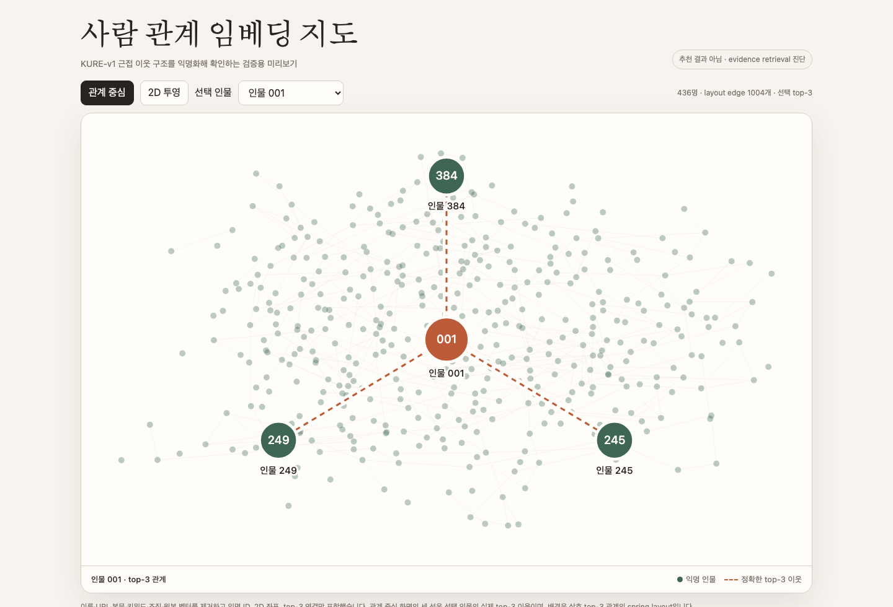
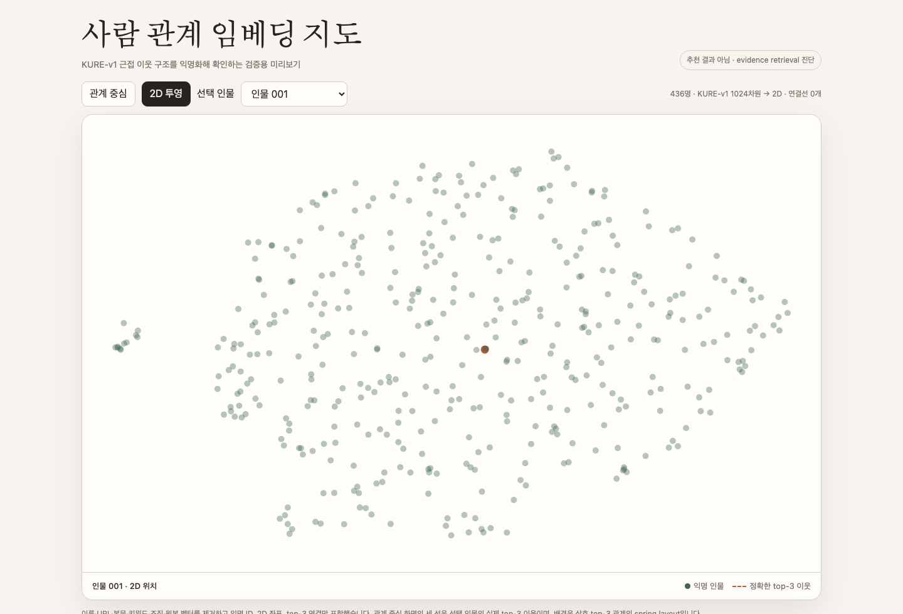

# 사람 관계 임베딩 지도 — 안전 미리보기

이 폴더는 로컬 KURE-v1 실험의 관계지도 v5를 PR에서 바로 검토할 수 있게
익명화한 산출물이다.





`index.html`을 브라우저로 열면 익명 인물을 바꾸며 아래 두 모드를 비교할 수 있다.

- 관계 중심: 선택한 인물과 정확한 top-3 이웃 세 명을 고정 반경으로 표시
- 2D 투영: UMAP 좌표를 점으로만 표시하며 연결선은 그리지 않음

## 데이터 경계

포함:

- 익명 ID
- spring/UMAP 2D 좌표
- top-3 이웃 ID
- 상호 top-3 배경 edge
- 모델·레이아웃 집계값

제외:

- 이름, URL, 글 제목·본문·인용·키워드
- 조직 연결 후보
- 원본 1,024차원 벡터
- SQLite와 Supabase 정보

이 지도는 공개 블로그 evidence의 근접 검색 구조를 진단하는 화면이지, 본인 확인과
매칭 동의를 마친 회원 추천 결과가 아니다.

재생성 명령:

```bash
node scripts/build-safe-embedding-preview.mjs \
  /absolute/path/to/viewer-v5.html \
  docs/demos/people-matching-map/index.html
```
